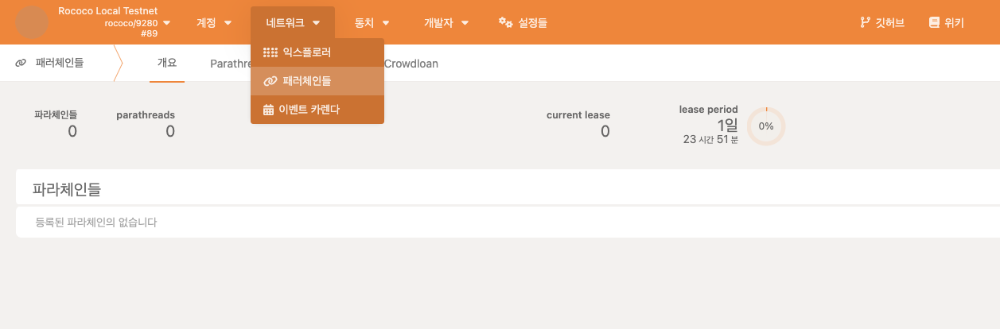
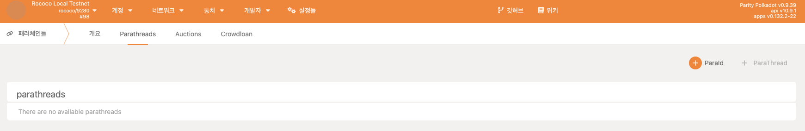
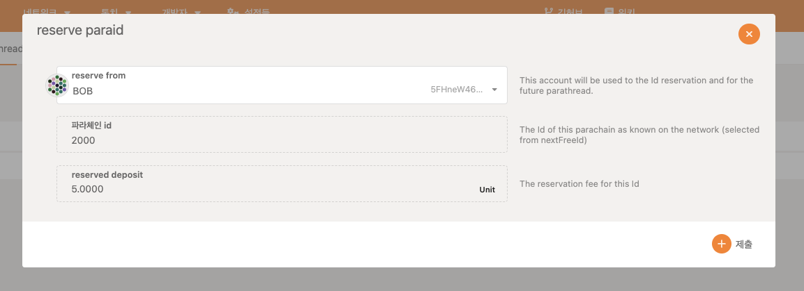
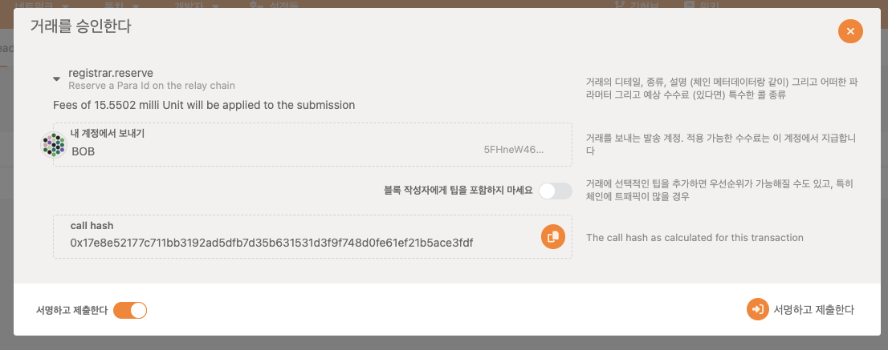
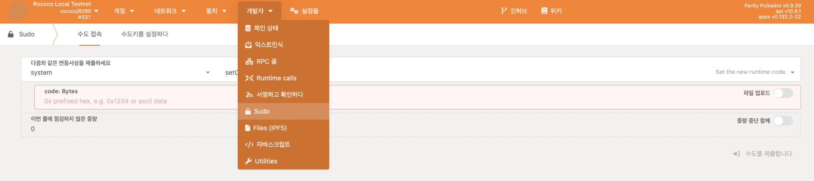
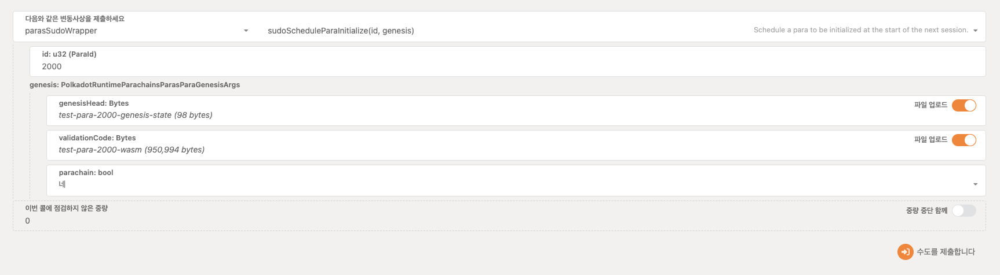
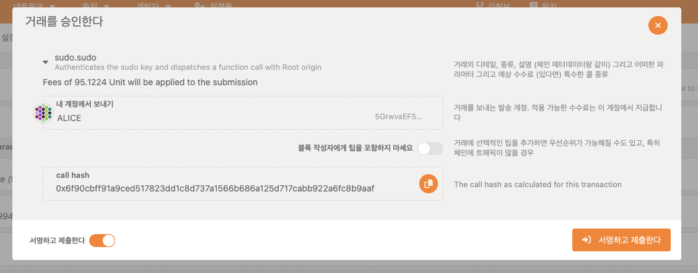
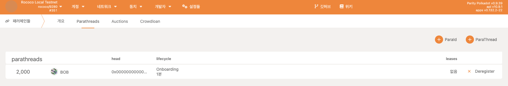
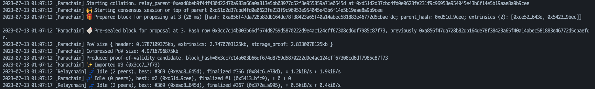

# Trust Meetup - 쿠버네티스를 활용한 노드환경 구성하기

해당 레포지토리는 쿠버네티스 위에 substrate 기반의 체인을 올리는 실습니다.

실습환경은 다음과 같이 설정했습니다.

- EKS -  v1.26.0
- polkadot relay image -  v0.9.39
- polkadot para image -   0.9.380

### 유의사항
1. polkadot docker image에 경우, x86_64를 기반으로 만들어져 있기에 apple m1칩에서 돌아가지 않습니다.
2. EKS에 경우, 스토리지 클래스로 Amazon EBS CSI driver를 사용하고 있습니다.
3. para chain 관련 스펙 파일들은 release에 있으므로 relase페이지에서 다운로드 받으셔야 합니다.

## 실습
----   
1. 먼저 git repository를 clone 받습니다.
```bash
git clone https://github.com/InfraBlockchain/trust-meetup-k8s.git
```

2. clone을 받았다면 폴더로 이동해줍니다.
```bash
cd trust-meetup-k8s
```

3. 쿠버네티스 명령어로 namespace를 생성해줍니다.
```bash
kubectl create namespace demo
```

4. bootnode 폴더에 있는 파일을 실행해줍니다.
```bash
kubectl apply -f bootnode
```
5. bootnode의 로그를 통해 Local node identity를 확인해줍니다.
```bash
❯ k logs bootnode-0 -f
Defaulted container "polkadot" out of: polkadot, download-spec (init)
2023-07-13 00:06:52 Parity Polkadot    
2023-07-13 00:06:52 ✌️  version 0.9.39-bf2ebf30780    
2023-07-13 00:06:52 ❤️  by Parity Technologies <admin@parity.io>, 2017-2023    
2023-07-13 00:06:52 📋 Chain specification: Rococo Local Testnet    
2023-07-13 00:06:52 🏷  Node name: Alice    
2023-07-13 00:06:52 👤 Role: AUTHORITY    
2023-07-13 00:06:52 💾 Database: RocksDb at /data/polkadot/chains/rococo_local_testnet/db/full    
2023-07-13 00:06:52 ⛓  Native runtime: rococo-9390 (parity-rococo-v2.0-0.tx19.au0)    
2023-07-13 00:06:58 🔨 Initializing Genesis block/state (state: 0x2c0c…2e26, header-hash: 0xcb14…d6d8)    
2023-07-13 00:06:58 👴 Loading GRANDPA authority set from genesis on what appears to be first startup.    
2023-07-13 00:07:00 👶 Creating empty BABE epoch changes on what appears to be first startup.    
2023-07-13 00:07:00 🏷  Local node identity is: 12D3KooWJPFmTpa4z61vA3uYDuKDqWnDgXG1duCTt94Ztf2akJSB    
```
6. boot node와의 peer 연결을 위한 relay chain을 설치하기 위해 realy 폴더에 있는 statefulset.yaml를 수정해줍니다. 수정해야 하는 부분은 spec.template.spec.containers의 relay쪽에 bootnodes 옵션이 있는데 보시면 node id 라고 적혀 있습니다. 이 부분을 아까 bootnode에서 봤던 local node identity값으로 수정해줍니다.
```bash
"/dns4/boot-headless-service/tcp/30333/p2p/<node id>"
->
"/dns4/boot-headless-service/tcp/30333/p2p/12D3KooWJPFmTpa4z61vA3uYDuKDqWnDgXG1duCTt94Ztf2akJSB"
```
7. 수정 후, bootnode를 실행했던 방법 그대로 relay도 실행해줍니다. 폴더 경로는 trust-meetup-k8s에서 진행해주면 됩니다.
```bash
kubectl apply -f relay
```
8. bootnode쪽 로그를 확인해보면 다음과 같은 내용을 확인할 수 있습니다.
```bash
2023-07-13 00:33:53 🔍 Discovered new external address for our node: /dns4/boot-headless-service/tcp/30333/p2p/12D3KooWRyfpY56KAfueV8CSKzV36ZW4NmHL8xjByMYCrPwBH8Rv    
2023-07-13 00:33:53 💤 Idle (1 peers), best: #39 (0x7d71…e312), finalized #0 (0xcb14…d6d8), ⬇ 1.4kiB/s ⬆ 8.1kiB/s   
```
9. parachain 연결을 위해서 parachain wasm과 gensis-state를 다운로드 받아줍니다.

10. https://polkadot.js.org/apps 로 이동합니다. 그리고 로컬테스넷과 연결하기 위해서 port forwarding을 해줍니다.
```bash
kubectl port-forward svc/relay-service-clusterip 9944:9944
```
11. 다음과 같이 파라id를 예약해줍니다.
    - 네트워크 메뉴에 있는 파라체인들을 클릭해줍니다.
    
    - parathreads를 클릭해줍니다.
    
    - paraId + 버튼을 클릭하고 제출을 눌러줍니다.
    
    - 서명하고 제출을 눌러줍니다.
    
12. 파라 id 예약을 완료했으므로 para chain을 올려줍니다. 올려주기 전에 relay chain과 동일한 방법으로 bootnode 옵션을 relay chain과 동일한 값으로 수정해줍니다.
13. 수정 후, para chain을 실행해줍니다.
```bash
kubectl apply -f para
```
14. para chain 실행 후, relay쪽 peer 가 잘 붙었는지 확인해줍니다. (처음에는 1개같붙고 후에2개로 늘어납니다.)
```bash
❯ k logs pods/para-0 -f 
2023-07-13 01:02:48 [Relaychain] ✨ Imported #325 (0xe05a…161f)    
2023-07-13 01:02:52 [Relaychain] 💤 Idle (1 peers), best: #325 (0xe05a…161f), finalized #323 (0xc528…b7bf), ⬇ 1.0kiB/s ⬆ 0.5kiB/s    
2023-07-13 01:02:52 [Parachain] 💤 Idle (0 peers), best: #0 (0xcaf2…b6a5), finalized #0 (0xcaf2…b6a5), ⬇ 0.1kiB/s ⬆ 0.1kiB/s    
2023-07-13 01:02:54 [Relaychain] ✨ Imported #326 (0xe5c9…9d35)    
2023-07-13 01:02:57 [Relaychain] 💤 Idle (2 peers), best: #326 (0xe5c9…9d35), finalized #323 (0xc528…b7bf), ⬇ 1.3kiB/s ⬆ 1.2kiB/s   
```
15. 다시 사이트로 돌아와서 sudo권한을 활용해서 para id를 initialized 해주겠습니다.
    - 개발자 메뉴에서 sudo를 선택해줍니다.
    
    - 아래 사진처럼 세팅을 해줍니다. 이때 genesis 관련 부분은 해당 레포 release에 있는 파일들을 사용해줍니다.
    
    - 제출을 해주시면 됩니다.
    
    - 제출이 완료되었으면 이전에 paraid를 예약했던 곳으로 이동하여 para가 등록되는 것을 기다립니다.
    
    - 등록이 완료되었다면 para로그를 확인하여 block이 생성되는지 확인해줍니다.
        ```bash
        ❯ k logs pods/para-0 -f 
        ```
        